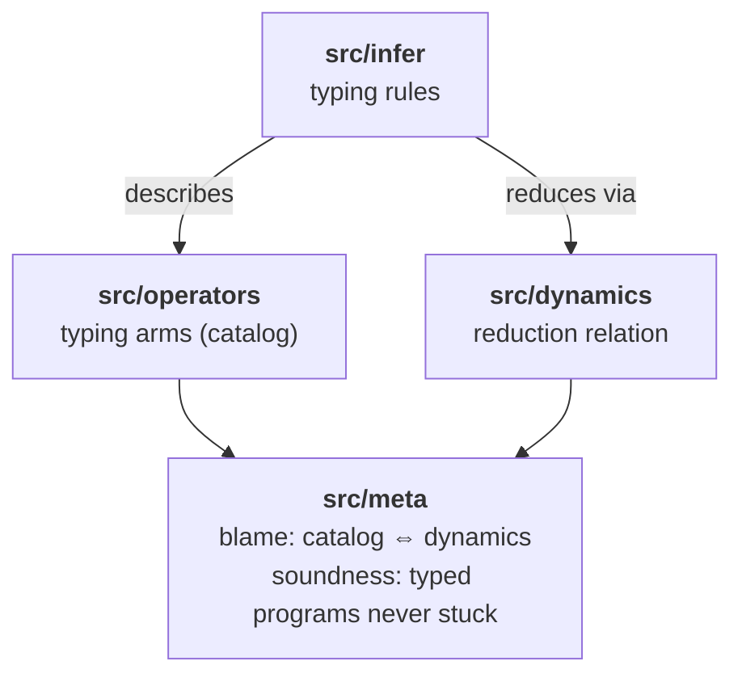

# minfern

Type checker with full type inference for a subset of JavaScript.

Try it online at: https://sinelaw.github.io/minfern/

Based on the type system developed for [infernu](https://github.com/sinelaw/infernu). See [infernu.md](infernu.md) for a partial formalization. The implementation also covers `this` resolution, Rank-1 restrictions on type annotations, and a value restriction for generalisation and polymorphic-property mutation; the formal document doesn't go into these.


The JavaScript checked by minfern is just JavaScript and can be run by browsers or any other runtime, or even embedded engines. See [mquickjs](https://github.com/bellard/mquickjs) which is a runtime that also supports a subset of JavaScript.

## Strictest ever mode

minfern requires every variable, expression, and function return to have a single type (though it may be polymorphic, or a closed union of literals or row shapes — see below). No type changes through assignment, no implicit coercion, and a value restriction that keeps mutable containers monomorphic.

## Type System Features

- **Full type inference**: No type annotations required, all types inferred. You probably want them for documentation, minfern can add them for you.

- **Polymorphic ("generic") functions**: `function id(x) { return x; }` works with any type. See `tests/test_polymorphism.js` for more examples.
  
- **Structural typing**: Objects typed by their shape:

  ```javascript
  function getName(obj) {
      return obj.name;
  }
  
  var person = {name: "Alice", age: 30};
  var dog = {name: "Rover", breed: "Labrador"};
  var product = {name: "Widget", price: 9.99};
  
  var name1 = getName(person);   // "Alice"
  var name2 = getName(dog);      // "Rover"
  var name3 = getName(product);  // "Widget"
  ```

- **Type classes**: `+` on Number/String, `[]` on Array/String/Map/Object

- **Unions of disagreeing branches**: branches of an `if`, ternary, or array literal are *joined* into a union when their types differ. Reading a member or indexing into a union pushes the operation through every member.

  ```javascript
  var pt = b ? {x: 1, y: 2} : {x: "a", z: 4};
  // pt: {x: Number, y: Number} | {x: String, z: Number}
  pt.x;     // Number | String  — joined across members
  ```

- **Narrowing predicates**: `typeof e === "..."`, `e === literal`, and `e.kind === "..."` refine a union-typed binding within a branch. `switch` on a literal-union discriminant gets exhaustiveness checking:

  ```javascript
  /** function area(s: {kind: "circle", r: Number}
                     | {kind: "square", s: Number}) => Number */
  function area(shape) {
      if (shape.kind === "circle") { return shape.r; }
      else                          { return shape.s; }
  }
  ```

- **Equi-recursive types**: Method chaining and builder patterns work naturally:

  ```javascript
  var requestBuilder = {
      url: "",
      method: "GET",

      setUrl: function(u) {
          this.url = u;
          return this;  // Returns the builder itself
      },

      setMethod: function(m) {
          this.method = m;
          return this;
      },

      send: function() {
          return this.method + " " + this.url;
      }
  };

  // Fluent chaining - each method returns the builder
  var response = requestBuilder
      .setUrl("/api/users")
      .setMethod("POST")
      .send();
  ```

  See `tests/test_builder_pattern.js` for more examples.

The rest is pretty basic (homogenous arrays, same-type conditionals and logical ops).

## Unsupported JavaScript Idioms

TLDR: Every variable has one type for its entire lifetime. The type may be a union, but it can't *change* under assignment, and operators that combine values still require their operands' types to agree.

- **No variable type changes**: `var x = 1; x = "hello"` is rejected — assignment unifies with the binding's existing type.
- **No type coercion at `+`**: `"Count: " + 42` is rejected — the `Plus` class requires both operands to be the same instance (Number, Number) or (String, String).
- **No mixed-type `&&` / `||`**: `obj && obj.x` requires both sides to share a type — `&&` and `||` return one of their operands and minfern unifies them. The default-value pattern `name || "Guest"` only works when `name` is also `String`.
- **No optional properties on inferred row types**: `var u = {name: "Bob"}; u.age` is rejected — the row is closed at construction. Optional values exist for built-ins that explicitly return them (e.g. `Array.prototype.find` returns `T | undefined`).
- **No dynamic property access with mixed value types**: `obj[key]` where `obj.name: String` and `obj.age: Number` — the `Indexable` constraint solver doesn't synthesise a union element type from a row's properties.
- **Narrowing requires an explicit union annotation**: `if (typeof x === "string") { … x.length … }` only narrows when `x`'s declared (or inferred) type is already a union containing String. With no annotation, the parameter is inferred as a fresh type variable and the condition can't widen it.

What was on this list before union/narrowing landed but is now supported:

- Mixed-type `if` / ternary branches (forms a union: `b ? 42 : "err"` → `Number | String`).
- Multiple return types in a function (forms a union: `if (found) return obj; else return null;`).
- Mixed-type array literals (joined element type: `[1, "two", 3]` → `(Number | String)[]`).
- Indexing into the above (`[1, "two"][0]` → `Number | String`).
- `typeof` narrowing inside a branch when the operand is union-typed.
- Discriminated unions via `kind`-tag literal narrowing in `if` and `switch`, with exhaustiveness warnings on closed-union switches.

## Supported Syntax

Template literals, regex literals, getters/setters, method shorthand, `for-of`, `const`, `let` (treated as `var` — block scoping isn't modelled), arrow functions, destructuring (object and array, desugared at parse time), `class` declarations (desugared into factory functions; no inheritance, no static members), `async`/`await` (desugared via `Promise.resolve`), and `import`/`export` with file-system-based module resolution.

Type annotations are accepted in two forms: inline `var x /*: T */` and doc-comment `/** var x: T */`. See [declare.md](declare.md) for the rules around external declarations and Rank-1 polymorphism.

## Testing and self-checking

minfern has four kinds of tests. The first three each fix a specific class of bug; the fourth is a meta-layer that asserts the first three agree with each other. Run everything with:

```
cargo test --lib -- --skip parser::proptests
cargo test --test metamorphic
```

(The skipped `parser::proptests` regression has one known-flaky seed unrelated to inference.)

### 1. Per-module unit tests (`src/*/tests.rs`, `src/*/*/tests.rs`)

Each module embeds a `#[cfg(test)] mod tests` block whose tests parse a JS source string and assert one fact about it. They cover:

- `src/infer/tests.rs` (~70 tests): runs `InferState::infer_program` on a source string and asserts the inferred type via `apply_subst` — annotation handling, value restriction, equi-recursive method chains, narrowing, switch exhaustiveness, union join behaviour.
- `src/infer/{unify,type_parser,decorate}/tests`: lower-level tests on individual algorithms.
- `src/dynamics/tests.rs` (~19 tests): runs the operational semantics on a source string and asserts the resulting `Value` — one fixture per arithmetic / comparison / logical / bitwise / unary / pseudo-op, plus closure-capture and fuel-exhaustion shape tests.
- `src/operators/tests.rs` (4 tests): structural integrity of the static catalog — every `BinOp`/`UnaryOp` AST variant has an entry, no duplicate names, every `SameAsArg(N)` references a valid input position, every `class: Some(c)` arm mentions `c` via at least one `AnyOfClass(c)`.

These pin specific behaviour: "this construct should infer this type", "this value-restriction case should reject", "`++x` on a number should produce x+1".

### 2. Metamorphic property tests (`tests/metamorphic.rs`)

There's no oracle for "is this program well-typed?", but there are *transformations* the type checker should be invariant under. Each property test generates a random program, applies one transformation, and asserts that `check(p) ≈ check(T(p))`:

- `t_swap_first_independent_pair` — swap two adjacent statements when neither uses the other's bindings; type result must be unchanged.
- `t_alpha_rename_existing` — capture-avoiding rename of a binding; type result unchanged modulo the rename.
- `t_prepend_empty`, `t_intersperse_empty`, `t_prepend_dead_var`, `t_wrap_expr_statements` — additions that shouldn't change anything.

These catch order-dependence and accidental name capture without anyone having to think of the specific case in advance.

### 3. Operator catalog and operational semantics

Two parallel *descriptions* of every operator. They exist so the meta-tests in §4 have something to cross-check.

- **The catalog (`src/operators/mod.rs`)** is a `static [OpInfo]` table. For each operator (`+`, `<=`, `===`, `typeof`, `[]`, …) it records the kind (BinOp / UnOp / pseudo), the dispatch axis, and a list of `TypingArm`s — input/output `TypeShape`s that the typing rule accepts. It's read-only metadata: the actual typing logic is in `src/infer/features/operators.rs`. Where the two disagree, the code wins and the catalog is wrong (and §4 catches it).

- **The dynamics (`src/dynamics/`)** is a small-step reduction relation. `eval_expr` and `eval_stmt` walk the AST and produce values via per-operator semantics in `step.rs`. Heap-allocated state (`Cell::{Object, Array, Var}`) lives in `src/dynamics/heap.rs`; closures snapshot a runtime env (`src/dynamics/env.rs`). Reduction is bounded by fuel (default 10 000 steps): non-terminating typed programs raise `Stuck::FuelExhausted` rather than hang. A program that gets stuck for any *other* reason (`TypeMismatch`, `NotCallable`, …) is a soundness violation by definition.

The dynamics is not a JS engine. It implements only what the typed subset reaches: `await` is identity on `Promise<T>`, `instanceof`/`in` raise `NotImplemented`, regex literals don't reduce. Anything outside the typed subset is documented inline at the rule site.

### 4. Catalog ⇔ dynamics meta-tests (`src/meta/`)

Two complementary tests over the catalog and the dynamics. Together they assert "every typing rule the catalog promises is one the operational semantics actually delivers".

**Cimini-Blame (`src/meta/blame.rs`)** enumerates *operators*. For each catalog `OpInfo`, for each `TypingArm`, for each enumeration of the arm's input shapes drawn from a fixed alphabet (`Number = "0"`, `String = "\"\""`, `Boolean = "true"`, `Null = "null"`, `Undefined = "void 0"`), the prober synthesises a tiny program (`(0) + ("")`, `void (0)`, `var __x = 1; ++__x`, …) and runs it through `dynamics::run_to_end`. If reduction gets stuck, the prober records a `BlameTriple`. The test asserts the resulting set is empty:

```
test meta::blame::tests::no_blame_triples_in_catalog ... ok
```

The probe alphabet is small by design — it's there to catch obvious gaps, not to enumerate exhaustively. Catalog arms that document a side-condition the table can't express (`==` allowing coercion, indexing dispatching on container kind, etc.) carry a `notes` field that opts them out of blame-checking.

The first time this test ran, it found two real catalog bugs: the `+` Plus arm declared `(AnyOfClass(Plus), AnyOfClass(Plus))` (which the prober expanded into mixed `(Number, String)` pairs that real typing rejects — the second slot should be `SameAsArg(0)`), and an `undefined` probe that was an identifier lookup rather than a literal.

**Soundness proptest (`src/meta/soundness.rs`)** enumerates *whole programs*. Three proptest strategies (`arb_number`, `arb_string`, `arb_boolean`) build expressions of a target type by construction — sample a target, then assemble an expression of that type from literals, arithmetic, comparisons, conditionals, the identity-function application, etc. For each generated source the probe:

1. Parses it.
2. Type-checks via `crate::infer` and asserts the inferred type matches the target.
3. Reduces via `crate::dynamics` and asserts the resulting `Value` matches the target.
4. Any `Stuck` other than `FuelExhausted` (soundness violation) or any type-vs-value mismatch (generator bug) fails the property.

64 generated cases run per strategy on every test invocation:

```
test meta::soundness::tests::generated_number_programs_sound ... ok
test meta::soundness::tests::generated_string_programs_sound ... ok
test meta::soundness::tests::generated_boolean_programs_sound ... ok
```

The generator is deliberately conservative — it emits only the constructions where typing and operational semantics are known to agree. Adding cases here is how soundness coverage grows as new typing features land. A failing case shrinks via proptest to a minimal counterexample.

### How the layers fit together



A new typing feature touches three files: the rule in `src/infer/features/...`, the catalog entry in `src/operators/mod.rs`, and an operational arm in `src/dynamics/step.rs`. The meta-tests then verify the three agree — by enumeration (blame) and by generation (soundness). If they don't, you find out at `cargo test`, not at runtime.

## Future Work

Some of the limitations above are annoying and may be worth supporting in some way or form. It would be nice to support nullable/optional-style union types, or explicit sum types. It would require some work to avoid losing the principal typing property (every expression has a single unambiguous most general type).

Not yet supported: spread/rest parameters, class inheritance, static class members.

## Project Overview

minfern is built as a small set of cooperating modules. Each one does one job; together they form a self-checking type system.

- **`src/lexer/` + `src/parser/`** — turn source into an AST. Type annotations live in JSDoc-style comments and are surfaced through the same lexer.
- **`src/types/`** — the core lattice (primitives, rows, arrays, functions, unions, literals, type schemes) and substitution.
- **`src/infer/`** — HMF-style type inference. Split along feature lines: `features/scalars.rs`, `features/arrays.rs`, `features/rows.rs`, `features/functions.rs`, `features/operators.rs`, `features/control.rs`, `features/bindings.rs`. The dispatcher in `features/../mod.rs` matches the AST shape and delegates. Per-feature reasoning lives in one file each.
- **`src/operators/`** — a static catalog describing every operator (`+`, `-`, `===`, `typeof`, `[]`, …) as data: arity, dispatch axis, and one or more typing arms. Documentation that gets cross-checked, not the implementation.
- **`src/dynamics/`** — a small-step operational semantics. A reduction relation over the typed subset that defines what each operator and statement *means at runtime*, with a fuel bound and an explicit `Stuck` reason for soundness reporting.
- **`src/classes/`** — declarative type-class instance tables (`Plus`, `Indexable`). Adding an instance is a one-line change here; the constraint solver in `src/builtins/` consults the table indirectly.
- **`src/meta/`** — meta-tests that cross-check the type system against itself. See [Testing and self-checking](#testing-and-self-checking).
- **`src/infer::InferConfig`** — runtime knobs for type-system policy (currently exhaustiveness warnings, value-restriction strictness). Defaults match the previous hardcoded behaviour; flipping a knob changes one rule.
- **`src/decorate.rs`** — re-emits the source with inferred types as comments, for IDE display and `--annotate` output.

The end-to-end pipeline is: `parse → infer → (optionally) decorate`. The dynamics, catalog, and meta-tests don't run in production; they exist so that adding a typing rule means you also describe its operator (catalog) and runtime behaviour (dynamics), and the test suite mechanically verifies the three agree.

